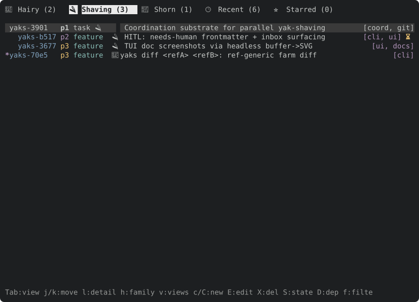
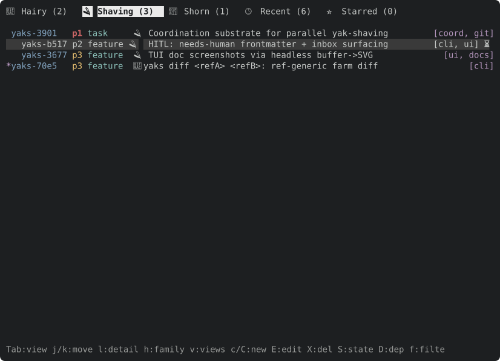
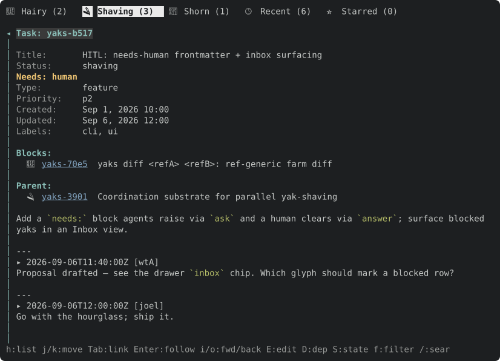

# toque

Drive a [ratatui](https://ratatui.rs) app **headlessly** — from under the hat, so to speak. Instead
of a real terminal, your app renders into an in-memory `TestBackend` buffer; you inject keys over a
tiny line protocol and get back a deterministic, plain-text snapshot after each step.

It does two things, both from a hidden position:

- **Drive** — feed keystrokes (`key j`, `key C-c`, `type hello`, `resize 80 24`).
- **Observe** — emit a text snapshot: a state header (internal facts you choose to expose) and the
  character grid (layout). The text snapshot is the cheap, greppable, diffable channel and carries
  no colour; when you need to *see* a frame, render the same buffer to **SVG**.

Because a frame is a pure function of the app plus the terminal size, the output is deterministic —
good for **agent-driven exploration** of a TUI *and* for `insta`-style **snapshot tests** of any
ratatui UI.

## What it looks like

Here is a short agent session against the [yaks](https://github.com/joelgwebber/yaks) TUI
(`yaks tui --headless --size 96x32`), hunting for the yak that is waiting on a human. The agent
sends one action per line (shown with a leading `>`); toque answers with a framed snapshot.
Blank rows are trimmed and the state headers abridged (`collapsed=` and `filter=` dropped) here for
space.

**1. Switch to the Shaving tab.** The `⏳` badge on `yaks-b517` marks a yak that needs a human.

```text
> key Tab
=== frame 1 · 96x32 · focus=list · view=🪒 Shaving · cursor=0 · rows=4 · sel=yaks-3901 · blocked=[yaks-70e5] · overlay=none ===
 🦬 Hairy (2)   🪒 Shaving (3)   🐑 Shorn (1)   🕒 Recent (6)   ⭐ Starred (0)

 yaks-3901   p1 task     🪒 Coordination substrate for parallel yak-shaving         [coord, git]
   yaks-b517 p2 feature  🪒 HITL: needs-human frontmatter + inbox surfacing         [cli, ui] ⏳
   yaks-3677 p3 feature  🪒 TUI doc screenshots via headless buffer->SVG              [ui, docs]
*  yaks-70e5 p3 feature  🦬 yaks diff <refA> <refB>: ref-generic farm diff                 [cli]
…
=== end ===
```



**2. Move down onto it.** In the text frame only the state header changes (`cursor=1`,
`sel=yaks-b517`), which is exactly what makes it cheap to diff. The highlighted row is colour, so
it only shows up in the SVG.

```text
> key j
=== frame 2 · 96x32 · focus=list · view=🪒 Shaving · cursor=1 · rows=4 · sel=yaks-b517 · blocked=[yaks-70e5] · overlay=none ===
 …same body as frame 1…
=== end ===
```



**3. Open it.** The header now says `focus=detail`, and the body has the question the yak is waiting
on (`Needs: human`).

```text
> key l
=== frame 3 · 96x32 · focus=detail · view=🪒 Shaving · cursor=1 · rows=4 · sel=yaks-b517 · blocked=[yaks-70e5] · overlay=none · detail_scroll=0 · pinned=no ===
 🦬 Hairy (2)   🪒 Shaving (3)   🐑 Shorn (1)   🕒 Recent (6)   ⭐ Starred (0)

◂ Task: yaks-b517
│
│ Title:       HITL: needs-human frontmatter + inbox surfacing
│ Status:      shaving
│ Needs:       human
…
│ ---
│ ▸ 2026-09-06T11:40:00Z [wtA]
│ Proposal drafted — see the drawer `inbox` chip. Which glyph should mark a blocked row?
…
=== end ===
```



The two channels do different jobs. The text frame and its state header are what an agent reads and
diffs, and it costs few tokens. The SVG is what you look at when colour, selection or layout is the
question. Both come from the same in-memory buffer, so they never disagree.

## Quick start

Implement `HeadlessApp`, then drive it:

```rust
use toque::{HeadlessApp, DriverOpts, run};
use ratatui::Frame;
use ratatui::crossterm::event::KeyEvent;

struct MyApp { /* … */ }

impl HeadlessApp for MyApp {
    fn render(&self, f: &mut Frame) { /* draw your widgets */ }
    fn handle_key(&mut self, key: KeyEvent) { /* mutate state */ }
    // optional: on_resize, state_header, should_quit
}

run(MyApp { /* … */ }, DriverOpts { width: 80, height: 24, diff: false }).unwrap();
```

`run` reads the protocol from stdin and writes frames to stdout. For tests, drive a `Session`
directly against any `Write` sink, or skip the protocol entirely with `render_to_buffer` +
`SnapshotEncoder`.

## Protocol

One action per stdin line; a framed snapshot follows each:

```text
key <name>     press one key: a char, or a name (Enter, Esc, Tab, BackTab,
               Space, Backspace, Up/Down/Left/Right, Home, End, PageUp,
               PageDown, Delete). Prefix `C-` for Ctrl (e.g. C-c).
type <text>    type each character of the rest of the line verbatim.
snapshot       re-emit the current frame.
resize <w> <h> change the terminal size.
wait <ms>      let time pass, then re-emit (see below).
quit           exit.
```

### Apps with state of their own

Not every app changes only when a key is pressed: a client of a server gets replies and pushes
whenever they arrive. Two optional hooks cover it:

- `settle(&mut self)` runs before every frame, so the app can absorb what has arrived (and wait
  for the replies its last key asked for). The frame then shows the settled state, not a race.
- `wait(&mut self, Duration)` is what the `wait <ms>` action calls, for what changes on its own
  (a progress bar, a clock). It sleeps by default; an app with its own clock can advance that
  instead, keeping tests instant.

A frame looks like:

```text
=== frame 3 · 80x24 · focus=list cursor=1 … ===
<body: the character grid, one line per row>
=== end ===
```

With `diff: true`, after the first (full) frame only changed body lines are emitted as `L<i>:
<line>` — a large token saving across a multi-step session.

## Visual output (SVG)

The text snapshot deliberately carries no colour — layout plus the state header are what a model
needs for cheap, diffable verification. When you need to *see* a frame (colour, bold/dim, borders),
render the same buffer to a self-contained SVG:

- `render_to_svg(&app, w, h) -> String` — drive and render in one call.
- `buffer_to_svg(&buffer) -> String` — render a buffer you already have.

The SVG is lean and row-ordered: one `<style>` class block for the palette, coalesced background
rects, and one `<text>` per row whose runs are `<tspan>`s pinned by an absolute `x` (a run breaks
after a wide glyph so an emoji can't shove the rest of the row out of column). It embeds directly in
Markdown/HTML and rasterises cleanly to PNG (e.g. via a headless browser) when a pixel image is
wanted — which also lets you control the resolution handed to a vision model.

> **History.** toque previously offered three *text* style-encodings (`spans`/`interleaved`/
> `parallel`) that packed per-cell colour into the snapshot. They were retired once SVG became the
> visual channel: SVG renders style natively and better, and the semantic style that matters
> (selection, focus, blocked) already rides in the state header as plain facts. The original
> evaluation that picked `spans` is kept for the record at
> [`docs/research/tui-style-eval.md`](https://github.com/joelgwebber/yaks/blob/main/docs/research/tui-style-eval.md).

## Status

Extracted from the [yaks](https://github.com/joelgwebber/yaks) TUI, its first consumer;
[canon](https://github.com/joelgwebber/canon)'s TUI is the second.
Pre-1.0: the API may shift as more apps adopt it.

## License

Apache-2.0.
